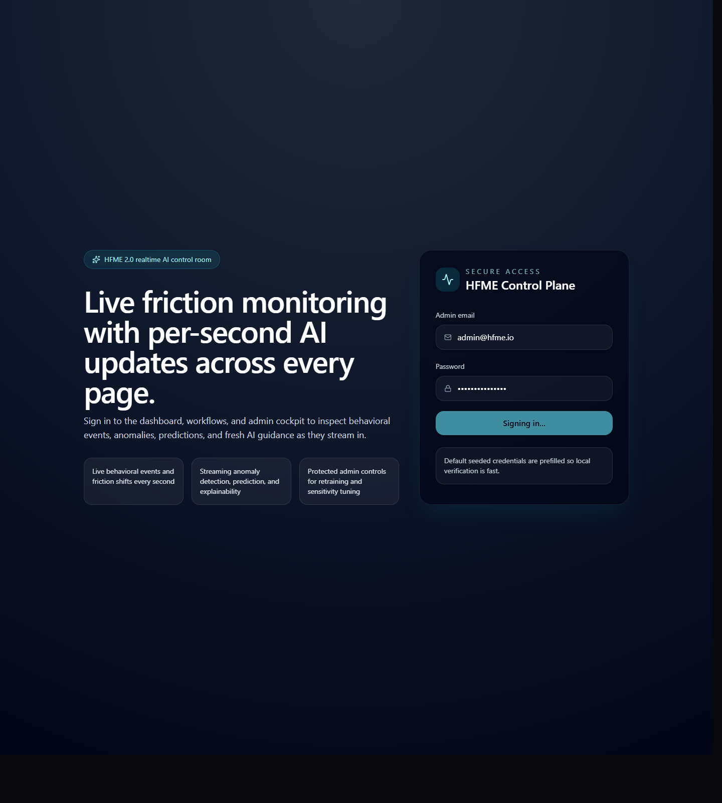
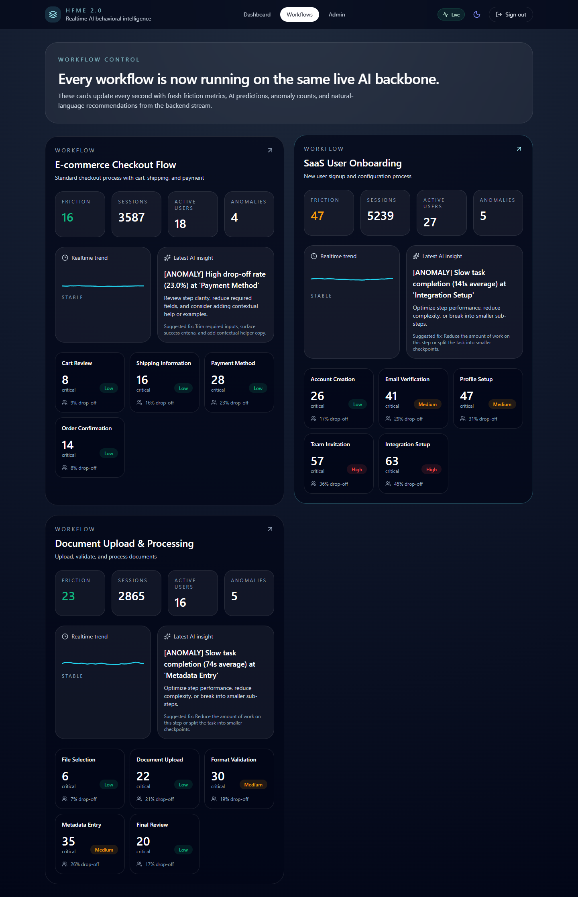
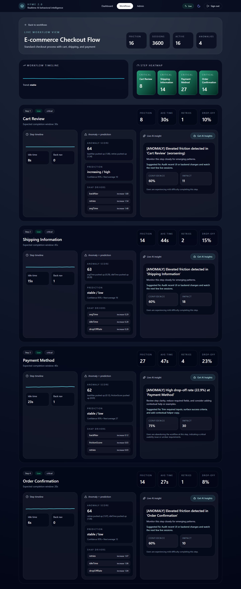
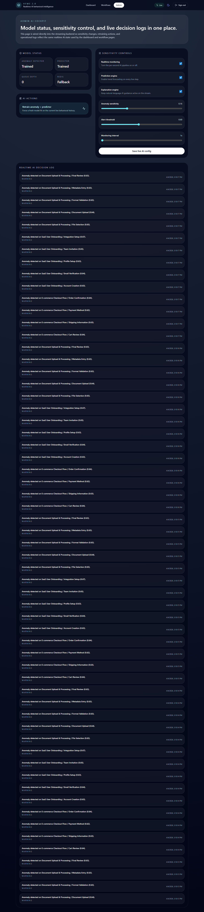

# HFME 2.0

Realtime AI behavioral analytics for multi-step workflows. HFME now streams live behavioral events, recalculates friction every second, detects anomalies, forecasts risk, and pushes fresh natural-language guidance into the dashboard, workflow views, and admin console.

## Screenshots

### Dashboard


### Workflows


### Workflow Detail


### Admin


## What Changed

- FastAPI now exposes a realtime SSE stream at `/events/stream`.
- A background worker continuously ingests live behavior batches and runs anomaly detection, prediction, and explanation refreshes.
- Redis Pub/Sub and a Redis queue are used when Redis is available, with an in-process fallback for local verification.
- Every major page now consumes the same typed live snapshot contract.
- The dashboard, workflows index, workflow detail page, and admin page all update automatically every second.
- Manual "Get AI Insights" actions route through the protected AI proxy and return fresh explanations plus suggested fixes.
- Admin controls can update live sensitivity settings and trigger retraining.
- Auth now protects the application and AI proxy routes with a signed session cookie.
- Browser automation screenshots were captured from the running app and stored in `public/screenshots/`.

## Architecture

```text
Next.js App Router
  -> protected auth + UI shells
  -> typed AI proxy routes (/api/ai/*)
  -> realtime client hook + SSE consumer

FastAPI AI Service
  -> /live/snapshot
  -> /events/stream
  -> /analyze/*
  -> /train/*
  -> /config
  -> background simulation + analysis loop

Storage / Messaging
  -> Prisma + SQLite demo database
  -> Redis Pub/Sub + queue when available
  -> in-memory fallback for local AI runtime continuity
```

## Realtime Data Flow

1. The seed script creates workflows, events, aggregated metrics, and `data/live-runtime.json`.
2. FastAPI loads that runtime map and starts a per-second simulation loop.
3. Each tick produces new behavioral events for every workflow.
4. The analysis worker updates live histories, runs Isolation Forest + the predictor, computes explainability, and refreshes insights.
5. FastAPI publishes the latest snapshot and streams it over SSE.
6. Next.js pages render an initial snapshot server-side, then stay live through the protected `/api/ai/stream` proxy.

## Local Development

### Prerequisites

- Node.js 20+
- Python 3.11+
- Redis 7+ if you want the Redis-backed path
- Docker Desktop only if you want the compose flow

### Environment

Copy `.env.example` to `.env`.

Important values:

- `DATABASE_URL="file:./dev.db"`
- `AI_SERVICE_URL="http://localhost:8000"`
- `AI_INTERNAL_API_KEY="hfme-internal-key"`
- `AUTH_SECRET="hfme-local-auth-secret"`

### Setup

```powershell
npm install
npm run db:generate
npm run db:push
npm run db:seed
python -m pip install -r ai-service\requirements.txt
```

### Run Locally

Terminal 1:

```powershell
python -m uvicorn ai-service.main:app --host 0.0.0.0 --port 8000
```

Terminal 2:

```powershell
npm run build
npm run start
```

Optional Redis:

```powershell
docker run -d -p 6379:6379 redis:7-alpine
```

## Docker Compose

`docker-compose up -d` now builds:

- `web`
- `ai-service`
- `redis`

The web image seeds the SQLite demo database during build so the app comes up with working demo data and a generated runtime map. The AI service copies `data/live-runtime.json` so its workflow IDs match the seeded UI.

Compose env defaults:

- `DATABASE_URL=file:./dev.db`
- `AI_INTERNAL_API_KEY=hfme-internal-key`
- `AUTH_SECRET=hfme-local-auth-secret`

## Default Login

```text
Email: admin@hfme.io
Password: hfme_admin_2024
```

## Key Routes

### App

- `/`
- `/workflows`
- `/workflows/[id]`
- `/admin`
- `/login`

### Protected Next.js AI Proxy

- `GET /api/ai/live`
- `GET /api/ai/stream`
- `POST /api/ai/insights`
- `GET /api/ai/status`
- `PUT /api/ai/config`
- `POST /api/ai/retrain`

### FastAPI

- `GET /health`
- `GET /live/snapshot`
- `GET /events/stream`
- `POST /analyze/anomaly`
- `POST /analyze/predict`
- `POST /analyze/explain`
- `POST /train/anomaly`
- `POST /train/predictor`
- `POST /train/realtime`
- `GET /models/status`
- `PUT /config`

## Explainability Notes

- SHAP-style explainability is wired into the anomaly detector.
- When the `shap` package is available, FastAPI can use it directly.
- On environments where `shap` cannot be compiled, HFME falls back to deterministic top-contributor scoring so the UI still receives feature drivers and suggested fixes.

## Verification Checklist

The current implementation was validated with:

- `npm run db:generate`
- `npm run db:push`
- `npm run db:seed`
- `npx tsc --noEmit`
- `python -m compileall ai-service`
- `npm run build`
- Local Next.js + FastAPI boot
- Protected login flow
- Live snapshot delta checks showing tick and friction changes between reads
- SSE stream output via `/api/ai/stream`
- Manual insight, config update, and retraining route checks
- Headless browser screenshot capture with Playwright Core + local Chrome .

## Troubleshooting

- If Redis is unavailable, the AI service will continue with its in-process queue fallback.
- If `docker-compose up -d` cannot connect to Docker, start Docker Desktop first.
- If FastAPI dependencies are missing locally, rerun `python -m pip install -r ai-service\requirements.txt`.
- If you need fresh demo IDs, rerun `npm run db:seed` to regenerate `data/live-runtime.json`.
